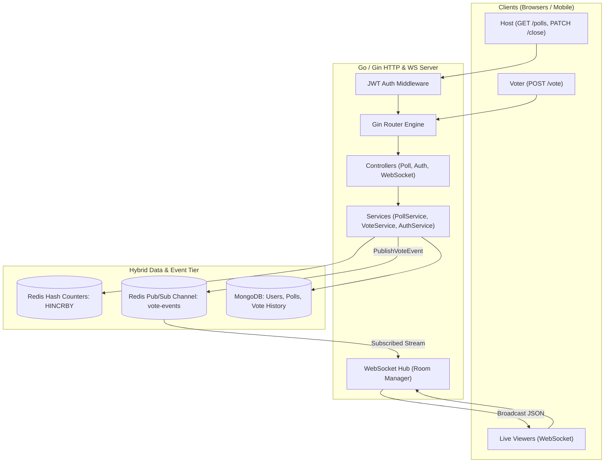

# PULSE – High-Concurrency Polling Engine (Backend)

[](https://golang.org/)
[](https://gin-gonic.com/)
[](https://www.mongodb.com/)
[](https://redis.io/)
[](https://github.com/gorilla/websocket)

> **PulsePoll Backend** is a high-throughput, low-latency polling microservice written in Go. Designed to handle concurrent voting traffic during live events, it leverages a hybrid storage engine (MongoDB for persistent entity storage and Redis for sub-millisecond atomic counters and Pub/Sub event distribution) coupled with WebSockets.

---

## 📌 Project & Candidate Information

* **Candidate Name:** Hari Dharshini G
* **Project Name:** PULSE – Full Stack Polling Application
* **Backend Repository:** [https://github.com/hari632/Pulse-Poll](https://github.com/hari632/Pulse-Poll)
* **Frontend Repository:** [https://github.com/hari632/Pulse-Poll--Frontend](https://github.com/hari632/Pulse-Poll--Frontend)
* **Live Deployed Application:** [https://pulse-poll-frontend.vercel.app/](https://pulse-poll-frontend.vercel.app/)
* **Project Walkthrough Video:** [Google Drive Folder](https://drive.google.com/drive/folders/1UB5jMGOM3FBZX6WRoeSgAbYun2c4Q2Fk?usp=sharing)

---

## 🏗️ System & Backend Architecture



---

## 💡 Key Architectural & Design Decisions

### 1. Hybrid Storage: Redis (In-Memory) + MongoDB (Persistent)
* **Problem:** Direct database writes during voting spikes (e.g. 5,000 users clicking simultaneously during a keynote) cause database lock contention and latency spikes.
* **Decision:**
  * **Redis:** Serves as the high-speed atomic write buffer. `HINCRBY` increments option vote tallies in sub-millisecond time.
  * **MongoDB:** Persists user profiles, poll metadata, and audit logs of each ballot asynchronously.

### 2. Horizontally Scalable WebSockets with Redis Pub/Sub
* **Problem:** If multiple Go server instances run behind a load balancer, clients connected to Instance B would not receive WebSocket broadcasts triggered by votes landing on Instance A.
* **Decision:** The `VoteService` publishes each vote event to the Redis channel `vote-events`. The `Hub` on every server instance listens to this channel and dispatches the payload to matching client rooms by `pollID` and `pollCode`.

### 3. Separation of Creator Controls & Public Access
* **Decision:**
  * Poll creation, poll listing (`/polls`), and poll closing (`/polls/:id/close`) are strictly protected via JWT Bearer tokens and creator ID verification.
  * Voting and results streams are unauthenticated, allowing frictionless participation without sign-up friction.

### 4. Clean Architecture (Layered Pattern)
* **`controllers/`**: HTTP request binding, validation, status codes.
* **`services/`**: Business logic, percentage normalization (guaranteeing exact 100% total), activity metrics calculation.
* **`repositories/`**: Database queries, Redis operations.
* **`websocket/`**: Client room lifecycle, concurrent read/write mutex synchronization, reconnection handling.

---

## 🛠️ Tech Stack & Libraries

* **Language:** Go (Golang) 1.27
* **Web Framework:** [Gin Web Framework](https://github.com/gin-gonic/gin)
* **Database Driver:** [MongoDB Go Driver v2](https://pkg.go.dev/go.mongodb.org/mongo-driver/v2)
* **In-Memory Cache & Pub/Sub:** [go-redis v9](https://github.com/redis/go-redis)
* **WebSocket Engine:** [Gorilla WebSocket](https://github.com/gorilla/websocket)
* **Authentication:** [golang-jwt/jwt/v5](https://github.com/golang-jwt/jwt)
* **Security:** `golang.org/x/crypto/bcrypt`

---

## 📁 Folder Structure

```
backend/
├── config/             # Environment configuration loaders
├── controllers/        # HTTP & WebSocket route handlers
│   ├── auth_controller.go
│   ├── poll_controler.go
│   └── websocket_controller.go
├── database/           # MongoDB and Redis connection managers
├── middleware/         # CORS & JWT authentication guards
├── models/             # Domain entities, DTOs & WebSocket event schemas
├── repositories/       # Mongo repositories, Redis counters & publishers
├── routes/             # Gin endpoint registrations (/api/v1 and /api)
├── services/           # Core domain logic (Voting, Polls, Auth)
├── utils/              # Token generation, helpers
├── websocket/          # Hub, client manager & broadcast distribution
├── main.go             # Application entrypoint
├── go.mod & go.sum     # Dependency declarations
└── .env                # Environment secrets
```

---

## 🔌 API Reference

### Authentication (`/api/v1/auth`)
| Method | Endpoint | Auth | Description |
| :--- | :--- | :--- | :--- |
| `POST` | `/auth/register` | No | Register a new poll host |
| `POST` | `/auth/login` | No | Authenticate host and receive JWT |
| `GET` | `/auth/me` | **Bearer JWT** | Fetch authenticated user profile |

### Poll Management (`/api/v1/polls`)
| Method | Endpoint | Auth | Description |
| :--- | :--- | :--- | :--- |
| `POST` | `/polls` | **Bearer JWT** | Create a new poll with 2–6 options |
| `GET` | `/polls` | **Bearer JWT** | List all polls created by current user |
| `PATCH`| `/polls/:id/close` | **Bearer JWT** | Terminate poll (host only) |
| `GET` | `/polls/:id` | No | Get live poll details, options, votes & stats |
| `POST` | `/polls/:id/vote` | No | Cast a vote for a poll option |
| `GET` | `/polls/:id/results` | No | Get current vote tallies & percentages |
| `GET` | `/polls/:id/live` | No | **WebSocket connection endpoint** |

---

## 📡 Real-Time WebSocket Event Payload

When a vote is cast, connected clients on `/polls/:id/live` receive real-time JSON frames:

```json
{
  "pollId": "65fc3b18...",
  "pollCode": "SPATV7",
  "optionId": "d3b07384...",
  "optionIndex": 0,
  "votes": [12, 8, 4, 2],
  "optionVotes": 12,
  "totalVotes": 26,
  "percentages": [46, 31, 15, 8],
  "peakActivity": "2026-09-19T11:10:00Z",
  "activity": "+4 votes in the last hour"
}
```

---

## 🚀 Getting Started Locally

### Prerequisites
* **Go**: 1.24+ (tested on Go 1.27)
* **MongoDB**: Local instance running on `mongodb://localhost:27017` or a MongoDB Atlas URI
* **Redis**: Local Redis server running on `localhost:6379` or Redis Cloud

### 1. Clone the Repository
```bash
git clone https://github.com/hari632/Pulse-Poll.git
cd Pulse-Poll
```

### 2. Configure Environment Variables
Create a `.env` file in the root directory:

```env
PORT=8080
GIN_MODE=debug
JWT_SECRET=your_super_secret_jwt_key_here

# MongoDB Configuration
MONGO_URI=mongodb://localhost:27017
# Or for MongoDB Atlas:
# MONGO_URI=mongodb+srv://<username>:<password>@cluster.mongodb.net/?retryWrites=true&w=majority
MONGO_DATABASE=pulse_db

# Redis Configuration
REDIS_ADDR=localhost:6379
REDIS_PASSWORD=
# Or for cloud Redis:
# REDIS_URL=rediss://default:<password>@<endpoint>:6379
```

### 3. Install Dependencies
```bash
go mod download
```

### 4. Run the Backend Server
```bash
go run .
```
The server will start at `http://localhost:8080` and log:
```
MongoDB connected successfully
Redis connected successfully
REALTIME: Redis subscribed successfully to channel: vote-events
PulsePoll backend starting on http://localhost:8080
```

---

## 🧪 Testing & Verification

Run Go compilation verification:
```bash
go build ./...
```

Run tests (if configured):
```bash
go test ./...
```

---

## 📄 License
This project is open-source and available under the [MIT License](LICENSE).
